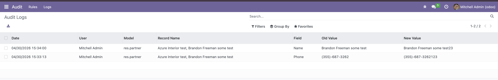

# Audit Log — Журнал аудита изменений

Odoo-модуль для отслеживания изменений в бизнес-записях: кто, что и когда изменил.

---

## Что это и зачем

Заказчик работает с CRM, партнёрами, сделками. Каждый день данные меняются — статусы, контакты, суммы. Без аудита ответить на вопросы невозможно:

- Кто изменил статус лида?
- Почему у партнёра другой телефон?
- Кто самый активный менеджер за месяц?

Модуль даёт **обратную прослеживаемость** — история изменений сохраняется автоматически и доступна прямо там, где нужна: внутри формы записи и в отдельном отчёте.

---

## Что видит заказчик

### Таймлайн внутри формы записи

Открывается лид или контакт — можно увидеть историю изменений прямо в форме:

```
Сегодня
  14:32  Иванов    Статус        Новый → В работе
  11:05  Петров    Телефон       +7999... → +7911...

Вчера
  17:20  Сидоров   Ответственный Иванов → Петров
```

Это не отдельный отчёт — это контекст прямо там, где нужен.

### Сводный отчёт

Руководитель открывает отчёт, выставляет период и видит:

- **Наиболее изменяемые записи** — какие данные нестабильны
- **Наиболее активные пользователи** — контроль нагрузки и аномалий
- **Общее количество изменений** — динамика активности

---

## Ключевая особенность

Отслеживание настраивается **через UI без изменений кода**.

Администратор заходит в настройки, выбирает модель (`crm.lead`, `res.partner` — любую) и поля, которые нужно отслеживать. Всё. Разработчик не нужен.

---

## Как это работает

### Структура модуля

```
audit_log/
├── models/
│   ├── audit_rule.py       # Правила отслеживания + патч-механизм
│   ├── audit_log.py        # Модель хранения изменений
│   └── audit_log_mixin.py  # Таймлайн для форм записей
├── wizard/
│   └── audit_summary.py    # Сводный отчёт (raw SQL)
├── security/
│   └── ir.model.access.csv
└── tests/
    ├── test_audit_rule.py
    └── test_audit_summary.py
```

### Поток данных

```
1. Администратор создаёт audit.rule (model=crm.lead, fields=[stage_id, phone])
              ↓
2. _register_hook() при старте Odoo читает активные правила
              ↓
3. write() нужных моделей динамически оборачивается (только они, не все 500+)
              ↓
4. Пользователь меняет запись в форме
              ↓
5. audited_write() перехватывает вызов:
   — читает старые значения ДО записи
   — вызывает оригинальный write()
   — сравнивает старые и новые значения
   — создаёт audit.log записи одним bulk INSERT
              ↓
6. В форме записи — таймлайн через get_audit_log_grouped()
   В меню Аудит  — сводный отчёт через wizard
```

### Почему `_register_hook()` + динамический патч

Это единственный подход, закрывающий требование "без изменений кода":

| Подход | Почему не подошёл |
|---|---|
| Mixin в каждую модель | Нужен код при каждом добавлении модели |
| Monkey-patch `BaseModel.write()` | Патчит все 500+ моделей Odoo, неприемлемый overhead |
| PostgreSQL triggers | Не видит пользователя Odoo, сложно показать в UI |
| `mail.thread` / chatter | Работает только на моделях с `mail.thread`, не универсален |

Существует готовый OCA-модуль [`auditlog`](https://github.com/OCA/server-tools/tree/16.0/auditlog) — production-ready, широко используется в индустрии. В реальном проекте используем готовый вариант.

### Производительность

- `tracked_fields` кешируются в `registry.__dict__` — нет SELECT на каждый `write()`
- Кеш инвалидируется при изменении правила через UI
- Все изменения одного `write()` сохраняются одним bulk `INSERT`
- Составной индекс `(model_name, record_id)` — таймлайн быстр даже на миллионах строк

### Масштабируемость

Таблица `audit.log` растёт бесконечно. При 10 пользователях × 100 изменений/день — 365k строк/год. Архитектура рассчитана на это:

- Индексы заложены при создании таблицы
- Бизнес управляет конфигурацией через UI — разработчик не нужен при добавлении новых моделей

Что потребует доработки при росте:

- Retention policy. При миллионах записей таблица audit_log будет расти бесконтрольно. Нужна архивация или TTL — этого в проекте нет.
- record_name хранится как строка-снапшот. Если запись переименована — старые логи покажут актуальное имя, не историческое.
- Патч не снимается без рестарта. При удалении audit.rule трекинг остаётся до перезапуска сервера.
---

## Как запустить

### Вариант 1 — Docker (рекомендуется)

Самый быстрый способ без установки зависимостей.

```bash
# Из папки проекта
cd /path/to/audit_log

# Поднять Odoo + PostgreSQL
docker compose up -d


# Открыть в браузере
open http://localhost:8069/web?debug=1
# логин: admin / пароль: admin

```

### Вариант 2 — локально на macOS

```bash
# 1. Установить зависимости
brew install python@3.10 postgresql@15 node libxml2 libxslt libjpeg

# 2. Запустить PostgreSQL и создать пользователя
brew services start postgresql@15
createuser -s odoo

# 3. Клонировать Odoo 16
git clone https://github.com/odoo/odoo.git --branch 16.0 --depth 1 ~/odoo16

# 4. Создать virtualenv и установить зависимости
python3.10 -m venv ~/odoo16-venv
source ~/odoo16-venv/bin/activate
pip install -r ~/odoo16/requirements.txt

# 5. Создать БД и установить модуль
createdb odoo16
~/odoo16/odoo-bin \
  --addons-path=~/odoo16/addons,/path/to/audit_log/.. \
  -d odoo16 --db_user=odoo \
  -i audit_log --stop-after-init

# 6. Запустить сервер
~/odoo16/odoo-bin \
  --addons-path=~/odoo16/addons,/path/to/audit_log/.. \
  -d odoo16 --db_user=odoo
```

Открыть: `http://localhost:8069`

### Настройка через UI после запуска

1. Зайти в **Настройки → Технические → Audit → Rules**
2. Создать правило — выбрать модель (например `res.partner`) и поля (`name`, `phone`)
3. Открыть любой контакт и изменить имя
4. Вернуться в **Audit → Logs** — запись появится
5. Открыть **Audit → Сводный отчёт** — выставить даты, нажать "Сформировать"



---

## Тестирование

### Запуск автотестов

**Через Docker:**
```bash
docker compose exec odoo odoo \
  --db_host=db --db_user=odoo --db_password=odoo \
  -d odoo --test-enable --stop-after-init \
  -i audit_log
```

**Локально:**
```bash
~/odoo16/odoo-bin \
  --addons-path=~/odoo16/addons,/path/to/audit_log/.. \
  -d odoo16 --db_user=odoo \
  --test-enable --stop-after-init \
  -i audit_log
```

### Что покрывают тесты

**`tests/test_audit_rule.py` — патч-механизм и запись лога**

| Тест | Что проверяет |
|---|---|
| `test_write_is_patched` | `write()` обёрнут после создания правила |
| `test_no_double_patch` | повторный `_patch_models` не создаёт рекурсию |
| `test_change_creates_log` | изменение поля создаёт запись в `audit.log` |
| `test_untracked_field_no_log` | неотслеживаемое поле не логируется |
| `test_no_log_if_value_unchanged` | запись не создаётся если значение не изменилось |
| `test_log_captures_user` | лог сохраняет `user_id` и `user_name` |
| `test_record_name_captured_before_write` | имя записи берётся ДО изменения |
| `test_cache_invalidated_on_rule_write` | кеш сбрасывается при изменении правила |
| `test_cache_invalidated_on_unlink` | кеш сбрасывается при удалении правила |
| `test_deactivated_rule_no_log` | деактивированное правило не пишет логи |

**`tests/test_audit_summary.py` — сводный отчёт**

| Тест | Что проверяет |
|---|---|
| `test_total_count` | корректный подсчёт общего числа изменений |
| `test_top_records_returned` | топ записей отсортирован по убыванию |
| `test_top_users_returned` | топ пользователей возвращается |
| `test_date_filter_from` | фильтр `date_from` исключает старые записи |
| `test_date_filter_to` | фильтр `date_to` включает записи за текущий день |
| `test_result_limit` | `result_limit` ограничивает количество строк |
| `test_clear_lines_on_regenerate` | повторная генерация очищает старые строки |
